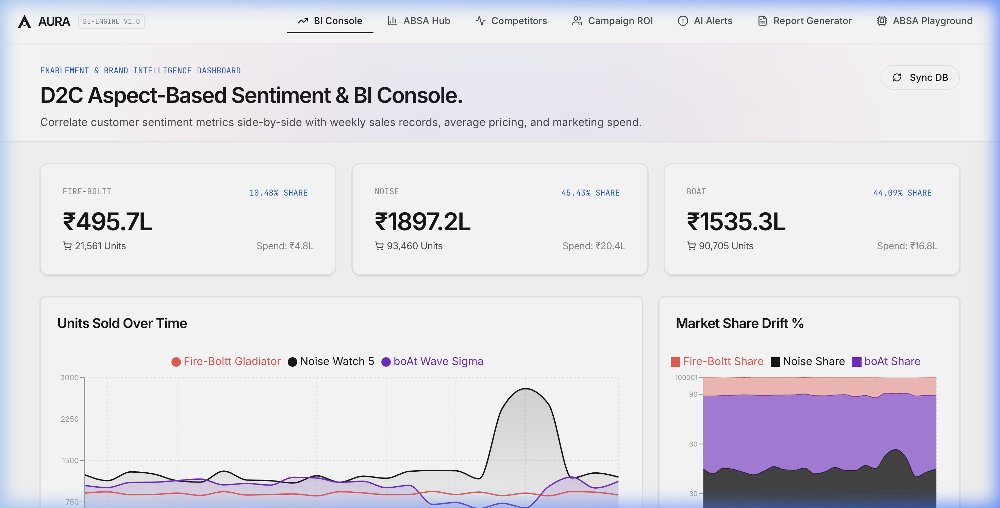
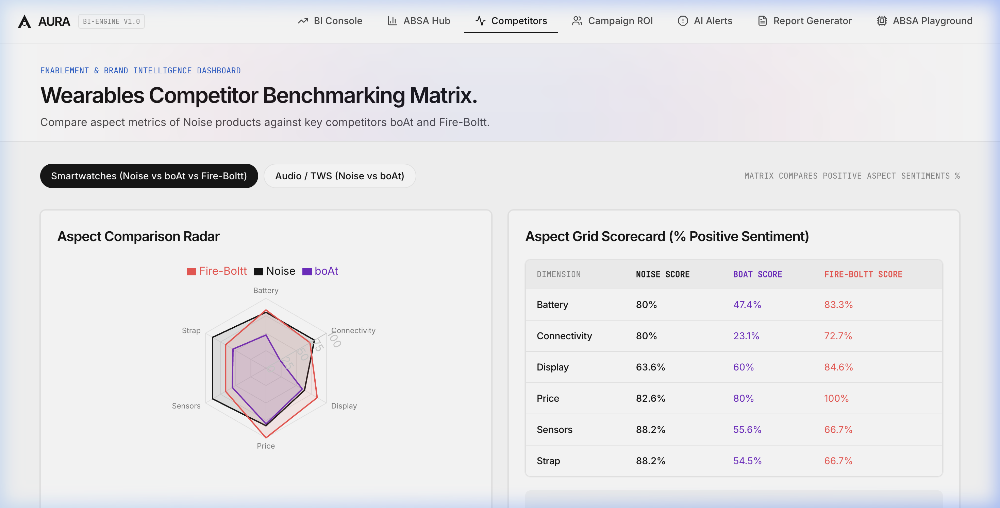
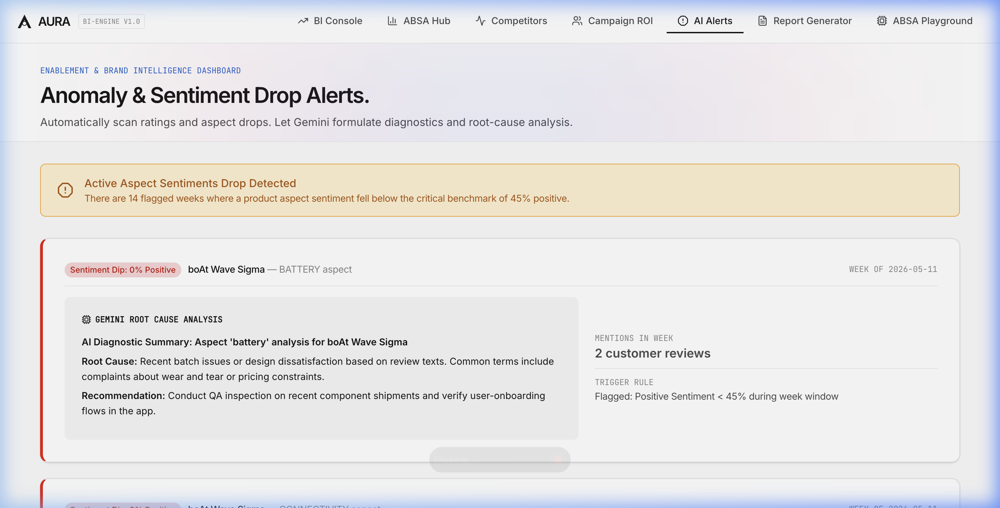
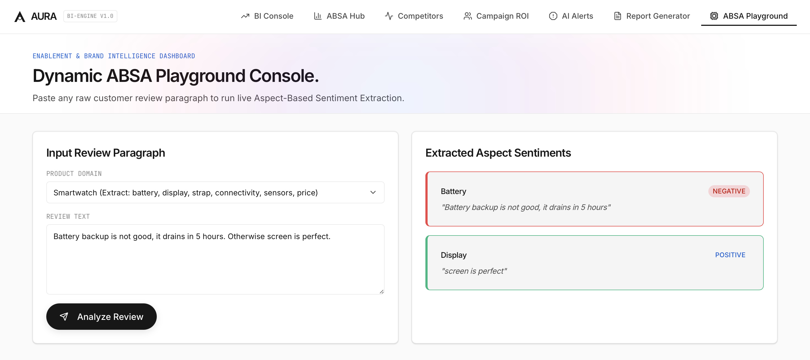
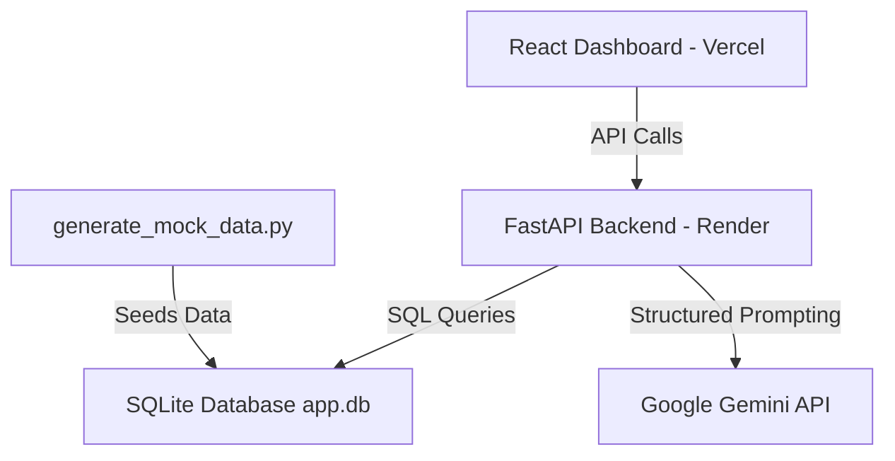

# Aura Aspect IQ ⚡️ D2C Brand & Competitor Analytics Dashboard

[](https://sentiment-analysis-dashboard-hazel.vercel.app)
[](https://sentiment-analysis-dashboard-wf9k.onrender.com/docs)
[](https://python.org)
[](https://react.dev)

A modern, high-fidelity Brand Intelligence and Business Intelligence (BI) console designed to ingest customer review data, perform **Aspect-Based Sentiment Analysis (ABSA)**, and evaluate competitor performance alongside sales metrics.

**Live Application URL:** [https://sentiment-analysis-dashboard-hazel.vercel.app](https://sentiment-analysis-dashboard-hazel.vercel.app)  
**Interactive API Playground (Swagger):** [https://sentiment-analysis-dashboard-wf9k.onrender.com/docs](https://sentiment-analysis-dashboard-wf9k.onrender.com/docs)

---

## 📸 Visual Preview & Video Walkthrough

### 🎬 Interactive Dashboard Video Walkthrough
Below is the screen recording capturing the full user flow, tab transitions, and AI report generator functions:


### 🖼️ Screenshot Gallery

| BI Console Overview | Competitor Radar Benchmarking |
| :---: | :---: |
|  |  |

| AI Alerts (Anomalies & Diagnostics) | ABSA Interactive Playground |
| :---: | :---: |
|  |  |

---

## 📖 Table of Contents
* [📸 Visual Preview & Video Walkthrough](#-visual-preview--video-walkthrough)
* [🎯 JD Alignment Summary](#-jd-alignment-summary)
* [💡 Core Features](#-core-features)
* [📊 Seeded BI & Sentiment Scenarios](#-seeded-bi--sentiment-scenarios)
* [⚙️ System Architecture](#%EF%B8%8F-system-architecture)
* [🛠️ Tech Stack](#%EF%B8%8F-tech-stack)
* [📂 Repository Structure](#-repository-structure)
* [🚀 Local Development Setup](#-local-development-setup)
* [☁️ Deployment Details](#%EF%B8%8F-deployment-details)

---

## 🎯 JD Alignment Summary
This project has been built specifically to demonstrate core competencies required for the **AI Intern – Enablement & Business Intelligence** role at **Noise**:
*   **Review Tracking & Aspect-Sentiment Profiles:** Automatically drills down reviews into dimensions (Battery, Display, Strap, sound, mic, comfort, and connectivity) for Noise and competitors.
*   **BI Metric Console & Spreadsheets:** Models average pricing (ASP), unit sales volume, and marketing spend, showing cross-dimensional correlation between customer sentiment shifts and sales volume.
*   **Competitor Benchmarking:** Offers direct comparison matrices between Noise, boAt, and Fire-Boltt products.
*   **AI Enabled Diagnostics:** Leverages the **Google Gemini API** to run automated root-cause diagnostics on aspect rating drops and generates executive markdown briefs.

---

## 💡 Core Features

### 1. Business Intelligence Console
Overlays customer sentiment metrics side-by-side with weekly sales records, average selling price, and marketing spend. Track market share drift across brands on a stacked timeline.

### 2. Aspect ABSA Hub
Drill-down into product aspect performance. See direct customer review snippets dynamically filtered by positive, negative, and neutral sentiment tags.

### 3. Competitor Benchmarking Matrix
Compare aspect metrics of Noise products against key competitors boAt and Fire-Boltt using interactive radar charts and side-by-side scorecards.

### 4. Influencer Campaign ROI Tracker
Analyze campaign effectiveness. Calculates the gross revenue bump and exact ROI of influencer campaign launches by comparing sales in target weeks against pre-campaign baselines.

### 5. Anomaly & Sentiment Drop Alerts
Scans ratings and aspect drops. If positive aspect sentiment drops below the critical 45% threshold during a week window, a alert is triggered. Gemini automatically reads negative review snippets to output a diagnostic root-cause summary.

### 6. "One-Click" AI Business Report Generator
Compiles weekly executive summaries directly formatting the database metrics into a print/save-to-PDF ready markdown report written autonomously by Gemini.

### 7. Interactive ABSA Playground
A sandbox console that allows pasting any raw text paragraph to run live aspect-sentiment extraction.

---

## 📊 Seeded BI & Sentiment Scenarios
To showcase the console's capability, the seeded synthetic database represents realistic, structured scenarios over a 6-month period:
1.  **The Competitor Firmware Glitch (boAt Wave Sigma):**  
    Around **April 10, 2026**, a firmware update causes a major connectivity bug for boAt's smartwatch. The aspect sentiment for connectivity drops from 80% to 15% positive, triggering a dashboard anomaly alert. This correlates with a simulated **35% drop** in boAt smartwatch unit sales over the next month.
2.  **Noise Influencer Activation (Noise ColorFit Pro 5):**  
    On **May 1, 2026**, Noise launches a ₹6L influencer marketing campaign (Technical Guruji + Tech Burner). The timeline tracks a massive boost in positive battery/display sentiment, reviews volume, and a **2.2x spike** in weekly sales revenue.

---

## ⚙️ System Architecture



---

## 🛠️ Tech Stack

### Frontend
*   **Core:** React (Vite template), JavaScript, HTML5.
*   **Styling:** Vanilla CSS (custom design variables, Vercel-inspired stark light canvas, and radial mesh gradient backdrops).
*   **Visualization:** Recharts (Area, Bar, Line, and Radar charts), Lucide-React (icons).

### Backend
*   **Framework:** Python FastAPI (REST API routes, CORS configuration).
*   **Data Manipulation:** Pandas (weekly resamples, rolling averages).
*   **Database:** SQLite (Relational SQL structure).
*   **AI Integration:** `google-genai` Python SDK (Gemini 2.5 Flash for summaries and diagnostics), `python-dotenv`.

---

## 📂 Repository Structure

```
sentiment_analysis_dashboard/
├── backend/
│   ├── app.db                   # SQLite database
│   ├── main.py                  # FastAPI server & endpoints
│   ├── database.py              # SQLite session provider
│   ├── pipeline.py              # Gemini ABSA & Anomaly Diagnostic helpers
│   ├── requirements.txt         # Backend dependencies
│   └── scripts/
│       └── generate_mock_data.py # Seeds review and BI databases
├── frontend/
│   ├── src/
│   │   ├── components/          # Dashboard sub-views
│   │   ├── App.jsx              # Main tab controller and state
│   │   ├── index.css            # Vercel-inspired CSS design system
│   │   └── main.jsx
│   ├── public/
│   │   └── favicon.svg          # Custom minimalist geometric favicon
│   ├── package.json
│   └── vite.config.js
├── .env.example                 # Template for API keys
└── deployment.md                # Serverless & VPS deployment configurations
```

---

## 🚀 Local Development Setup

### 1. Clone & Setup Backend
First, ensure you have Python 3.11+ installed.

```bash
# Clone the repository
git clone https://github.com/TAKSH-PAL/sentiment_analysis_dashboard.git
cd sentiment_analysis_dashboard

# Create virtual environment
python3 -m venv .venv
source .venv/bin/activate

# Install requirements
pip install -r backend/requirements.txt

# Seed the database
python3 backend/scripts/generate_mock_data.py
```

Create a `.env` file in the root directory and add your Gemini API Key:
```env
GEMINI_API_KEY=your_google_gemini_api_key_here
```

Start the FastAPI server:
```bash
# Runs uvicorn from backend/ folder on port 8000
uvicorn main:app --app-dir backend --port 8000 --env-file .env
```

### 2. Setup Frontend
In a separate terminal window:

```bash
cd frontend
npm install

# Start Vite dev server
npm run dev
```

Open [http://localhost:5173](http://localhost:5173) in your browser.

---

## ☁️ Deployment Details
*   **Backend:** Hosted on **Render** as a Python Web Service.
*   **Frontend:** Hosted on **Vercel** as a static project.
*   **Cold Start Support:** The React loading screen detects cold starts. If the backend is asleep (which happens on Render's free tier after 15 minutes of inactivity), the app displays an active timer along with a card explaining the wake-up delay (50–90 seconds) to ensure recruiters have a smooth onboarding experience.
